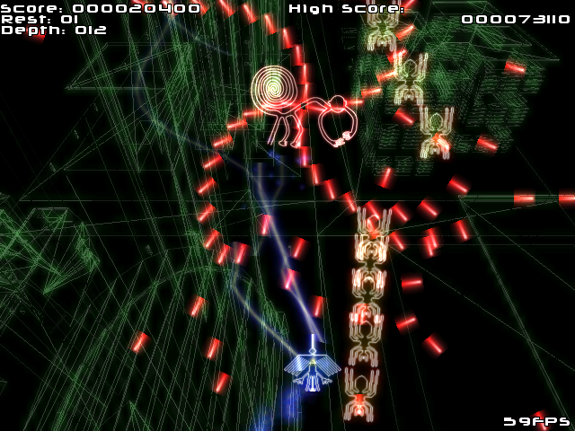

# Strahlengeier

A simple bullet-hell vertical-scrolling shooter game.  
With respect for [Nomltest]( http://www.yomogi.sakura.ne.jp/~si/ ).

**シュトラーレンガイアー**

シンプルな縦スクロールシューティング。  
[Nomltest]( http://www.yomogi.sakura.ne.jp/~si/ )をリスペクトしたゲームになっています。

## Screenshots / スクリーンショット

## How to play / 遊び方

`bin/Strahlengeier.exe` is the executable (i.e. playable) binary.

- Z key: Shoot
- X key: Slow down
- F3 key: Take screenshots

---
`bin/Strahlengeier.exe` が遊べるバイナリです。

- Zキー：ショット
- Xキー：スロー
- F3キー：スクリーンショット

## Dependent libraries / 使用ライブラリ

- [DxLib]( https://dxlib.xsrv.jp/ )
- [Boost]( https://www.boost.org/ )

## LICENSES / 使用素材等

- BGM: [Cyber-Rainforce]( https://cyber-rainforce.net/ )

## Others / その他

This game uses a font [Neuropol]( http://typodermicfonts.com/neuropol/ ), but can't embed the font file because of the licensing problem. It can be embedded by downloading and placing under the name `bin/img/font.ttf`.

---

このゲームは[Neuropol]( http://typodermicfonts.com/neuropol/ )というフォントを使用していますが、ライセンスの問題でここで配布しているバイナリにはフォントファイルが埋め込まれていません。フォントファイルをダウンロードして `bin/img/font.ttf` という名前で配置することで埋め込むことができます。